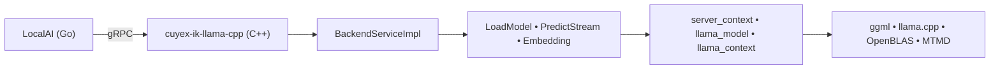

# 🧠 `cuyex-ik-llama-cpp`  
### **Backend gRPC de Alto Rendimiento y Enfoque en Privacidad para LocalAI**  
#### *Binario totalmente estático • Consciente de NUMA • Listo para producción en Intel Xeon*

<p align="center">
  
  
  
</p>

---

## 🌟 ¿Por qué este backend?

> **Privacidad. Control. Rendimiento.**  
> Ejecuta modelos de lenguaje grandes *localmente*, en tu propio hardware: sin nube, sin latencia, sin que tus datos salgan de tu infraestructura.

| ✅ **Binario totalmente estático** | 🔒 Sin dependencias dinámicas — funciona incluso sin conexión a internet |
|------------------------------------|--------------------------------------------------------------------------|
| 🧮 **Optimizado para NUMA**        | Distribuye automáticamente la carga entre sistemas con doble socket Xeon |
| 🔄 **Streaming nativo**            | Entrega tokens en tiempo real con soporte completo de plantillas de chat |
| 🛠️ **Listo para producción**      | Probado en entornos educativos y corporativos reales |

---

## 🚀 Despliegue Rápido  
*(Sin registro. Sin reconstrucciones. Sin fricción.)*

```bash
# 1️⃣ Clona LocalAI y este backend
git clone https://github.com/mudler/LocalAI.git && cd LocalAI/backends/cpp/
git clone https://github.com/ruribe17/cuyex-ik-llama-cpp.git

# 2️⃣ Construye (una sola vez)
cd cuyex-ik-llama-cpp && make 2690v4

# 3️⃣ Copia el binario al directorio de backends de LocalAI (por ejemplo: /opt/local-path-backends/)
sudo mkdir -p /opt/local-path-backends/cpu-ikllama-cpp
sudo cp output/ik-llama-cpp-2690v4 /opt/local-path-backends/cpu-ikllama-cpp/

# 3️⃣ Copia librerias al directorio de backends de LocalAI
sudo cp prepare.sh /opt/local-path-backends/cpu-ikllama-cpp/
sudo cp package.sh /opt/local-path-backends/cpu-ikllama-cpp/
sudo cp run.sh /opt/local-path-backends/cpu-ikllama-cpp/
sudo cp -r ./lib/. /opt/local-path-backends/cpu-ikllama-cpp/lib/
sudo chmod -R +x /opt/local-path-backends/cpu-ikllama-cpp/lib/

# ✅ ¡Listo! Inicia LocalAI: el backend se detecta automáticamente.
```

> 💡 **Importante:**  
> - El directorio debe llamarse **`cpu-ikllama-cpp`**  
> - El binario debe llamarse **`grpc-server`**  
> Estos nombres permiten que LocalAI lo descubra sin configuración adicional.

---

## 🧩 Características Soportadas

| ✅ **Chat y Completions** | Streaming, tools, tool_choice, JSON schema, gramática |
|---------------------------|--------------------------------------------------------|
| 📝 **Embeddings**         | Soporte completo (requiere `-DGGML_EMBEDDINGS=ON`)    |
| 🔍 **Reranking**          | Optimizado para RAG y búsqueda semántica               |
| 🧠 **Plantillas de Chat** | `use_tokenizer_template`, plantillas personalizadas, `messages` |
| 🖥️ **Consciente de NUMA** | Balanceo automático en doble socket Xeon (E5-2690 v4+) |
| 🧬 **LoRA y Escalado RoPE** | YARN, Linear, Flash Attention (vía `llama.cpp`)      |

---

## 🔬 Arquitectura



### Componentes Clave

| Módulo | Función |
|--------|---------|
| `grpccod/` | Implementación del servicio gRPC (salud, inferencia, embeddings) |
| `commoncod/` | Mapeo Proto ↔ JSON, logs, validación UTF-8 |
| `server/` | Wrappers seguros para `server_context`, `slots`, `queue` |
| `llama.cpp/` | Motor de inferencia optimizado (fork `ik_llama.cpp`) |

---

## 🧪 Prueba Directa con gRPC  
*(Sin necesidad de LocalAI)*

```bash
# Inicia el backend
/opt/local-path-backends/cpu-ikllama-cpp/grpc-server --port 50051 &

# Verifica salud
grpcurl -plaintext \
  -import-path /opt/local-path-backends/proto \
  -proto backend.proto \
  -d '{}' \
  localhost:50051 backend.Backend/Health

# Carga un modelo
grpcurl -plaintext \
  -import-path /opt/local-path-backends/proto \
  -proto backend.proto \
  -d '{"ModelFile":"/ruta/a/tu-modelo.gguf","ContextSize":262144,"Threads":28}' \
  localhost:50051 backend.Backend/LoadModel

# Inferencia con chat
grpcurl -plaintext \
  -import-path /opt/local-path-backends/proto \
  -proto backend.proto \
  -d '{
    "messages": [{"role": "user", "content": "Hola"}],
    "parameters": {
      "use_tokenizer_template": true,
      "n_predict": 100
    }
  }' \
  localhost:50051 backend.Backend/PredictStream
```

> ✅ **Nota:** Usa `messages` en lugar de `Prompt` para respetar el estándar de chat de LocalAI.

---

## 📦 Objetivos de Construcción

| Objetivo      | Uso |
|---------------|-----|
| `make 2690v4` | **Producción** (Xeon E5-2690 v4, binario estático) |
| `make avx2`   | Genérico AVX2 (cualquier CPU moderna) |
| `make avx512` | Cargas avanzadas (soporte AVX-512) |
| `make diagnose` | Diagnóstico de entorno y rutas |

---

## 🔑 Destacados Técnicos

- **Sin dependencias en runtime**  
  Enlazado totalmente estático (`-static-libgcc -static-libstdc++ -flto`)  
  → No requiere `libstdc++.so`, `libgrpc.so` ni `libopenblas.so`.

- **Seguro y escalable**  
  `std::atomic<bool>` y mutexes internos garantizan acceso concurrente seguro.

- **Manejo robusto de errores**  
  `LoadModel` devuelve `success=false` en fallos; el streaming **nunca duplica tokens**.

- **Construcción aislada**  
  Directorios de build fuera del código fuente (`builds/`) — no modifica `llama.cpp/`.

---

## 🌍 Casos de Uso

| Sector | Aplicación |
|--------|------------|
| 🏫 **Educación** | Laboratorios privados de LLM, investigación, desarrollo curricular |
| 🏢 **Empresas** | Asistentes internos seguros, pipelines RAG |
| 🔬 **Investigación** | Inferencia reproducible, auditables y bajo control total |
| 🏗️ **Edge / On-Prem** | Despliegue en cualquier lugar, incluso en entornos aislados |

---

## 📚 Documentación y Recursos

- **ik_llama.cpp:** https://github.com/ikawrakow/ik_llama.cpp  
- **LocalAI:** https://github.com/mudler/LocalAI  
- **Definición Proto:** `backend.proto` (auto-enlazado con `make proto-link`)  
- **Logs:** `journalctl -u localai -f`  

---

> 🛡️ **Diseñado con responsabilidad.**  
> *Tus datos se quedan en tu hardware. Tus modelos están bajo tu control. Tu privacidad permanece contigo.*

---

**© 2024 — Sistema CuyexLLM, Colegio Santa Rosa de Lima**  
*IA centrada en privacidad, diseñada para impacto real.*  
🌐 [elearning.starosa.edu.pe](https://elearning.starosa.edu.pe)

<p align="center">
  
</p>

¿Quieres que te genere también una versión para `CONTRIBUTING.md` o `docs/`?
