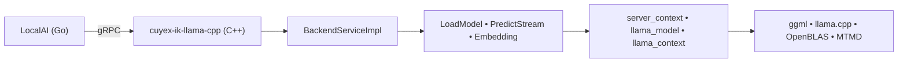

# 🧠 `cuyex-ik-llama-cpp`  
### **High-Performance, Privacy-First gRPC Backend for LocalAI**  
#### *Fully static • NUMA-aware • Production-ready on Intel Xeon*  

<p align="center">
  
  
  
</p>

---

## 🌟 Why This Backend?

> **Privacy. Control. Performance.**  
> Deploy powerful LLMs *locally*, on your own hardware — no cloud, no latency, no data leaving your infrastructure.

| ✅ **Fully Static Binary** | 🔒 No dynamic dependencies — runs anywhere (even offline) |
|----------------------------|-------------------------------------------------------------|
| 🧮 **NUMA-Optimized**      | Auto-balances workloads across dual-socket Xeon systems   |
| 🔄 **Native Streaming**     | Real-time token streaming with full chat template support |
| 🛠️ **Production-Ready**    | battle-tested in educational & enterprise environments     |

---

## 🚀 Lightning-Fast Deployment  
*(No registration. No rebuilds. No friction.)*

```bash
# 1️⃣ Clone into LocalAI backend directory
git clone https://github.com/mudler/LocalAI.git && cd LocalAI
git clone https://github.com/your-org/cuyex-ik-llama-cpp.git backend/cpp/cuyex-ik-llama-cpp

# 2️⃣ Build (one-time)
cd backend/cpp/cuyex-ik-llama-cpp && make 2690v4

# 3️⃣ Deploy — just copy the binary
sudo cp output/ik-llama-cpp-2690v4 /opt/local-path-backends/cpu-ikllama-cpp/grpc-server

# ✅ Done. Start LocalAI — backend auto-detects.
```

> 💡 **Note:** The directory `cpu-ikllama-cpp` and binary name `grpc-server` are required for LocalAI discovery.

---

## 🧩 Supported Features

| ✅ **Chat & Completions** | Streaming, tools, tool_choice, JSON schema, grammar |
|---------------------------|-------------------------------------------------------|
| 📝 **Embeddings**         | Full support (requires `-DGGML_EMBEDDINGS=ON`)      |
| 🔍 **Reranking**          | Optimized for RAG & semantic search                  |
| 🧠 **Chat Templates**     | `use_tokenizer_template`, custom templates, `messages` |
| 🖥️ **NUMA Awareness**     | Automatic dual-socket load balancing (Xeon E5-2690 v4+) |
| 🧬 **LoRA & RoPE Scaling**| YARN, Linear, Flash Attention (via `llama.cpp`)     |

---

## 🔬 Architecture Overview



### Key Components

| Module | Role |
|--------|------|
| `grpccod/` | gRPC service implementation (health, predict, embeddings) |
| `commoncod/` | Proto ↔ JSON mapping, logging, UTF-8 validation |
| `server/` | Thread-safe wrappers for `server_context`, `slots`, `queue` |
| `llama.cpp/` | Optimized inference engine (ik_llama.cpp fork) |

---

## 🧪 Direct gRPC Testing  
*(No LocalAI needed)*

```bash
# Launch backend
./ik-llama-cpp-2690v4
# Load a Model
grpcurl -plaintext -import-path /root/backendikllama-cpp2/LocalAI/backend -proto backend.proto -d '{"ModelFile":"/opt/local-path-provisioner/Qwen3-Coder-Next-UD-IQ3_XXS-R3.gguf","ContextSize":262144,"Threads":28,"MMap":true,"MLock":false,"F16Memory":false,"NBatch":8192,"NGQA":0,"Tokenizer":"","NoMulMatQ":true,"Quantization":"","GPUMemoryUtilization":0,"TrustRemoteCode":false}' localhost:50051 backend.Backend/LoadModel
# Health
grpcurl -plaintext   -import-path /root/backendikllama-cpp2/LocalAI/backend   -proto backend.proto   -d '{}'   localhost:50051   backend.Backend/Health
# Chat inference
 grpcurl -plaintext -import-path /root/backendikllama-cpp2/LocalAI/backend -proto backend.proto -d '{"Prompt": "Hello", "Tokens": 10}' localhost:50051 backend.Backend/PredictStream
```

---

## 📦 Build Targets

| Target      | Use Case                              |
|-------------|---------------------------------------|
| `make 2690v4` | **Production** (Xeon E5-2690 v4, static) |
| `make avx2`   | Generic AVX2 (any modern CPU)          |
| `make avx512` | Advanced workloads (AVX-512 support)   |
| `make diagnose` | Debug environment & paths            |

---

## 🔑 Technical Highlights

- **Zero Runtime Dependencies**  
  Fully static linking (`-static-libgcc -static-libstdc++ -flto`)  
  → No `libstdc++.so`, `libgrpc.so`, or `libopenblas.so` required at runtime.

- **Thread-Safe & Scalable**  
  `std::atomic<bool>` + internal mutexes ensure safe concurrent access.

- **Robust Error Handling**  
  `LoadModel` returns `success=false` on failure; streaming never duplicates tokens.

- **Build Isolation**  
  Out-of-source builds (`builds/`) — never pollutes `llama.cpp/`.

---

## 🌍 Use Cases

| Sector | Application |
|--------|-------------|
| 🏫 **Education** | Private LLM labs, research, curriculum development |
| 🏢 **Enterprise** | Secure internal knowledge assistants, RAG pipelines |
| 🔬 **Research** | Reproducible, auditable inference with full control |
| 🏗️ **Edge / On-Prem** | Deploy anywhere — even air-gapped environments |

---

## 📚 Documentation & Resources

- **ik_llama.cpp:** https://github.com/ikawrakow/ik_llama.cpp  
- **LocalAI:** https://github.com/mudler/LocalAI  
- **Proto Definition:** `backend.proto` (auto-linked via `make proto-link`)  
- **Logs:** `journalctl -u localai -f`  

---

> 🛡️ **Built for responsibility.**  
> *Your data stays on your hardware. Your models stay under your control. Your privacy stays yours.*

---

**© 2026 — CuyexLLM System, Colegio Santa Rosa de Lima**  Website: https://elearning.starosa.edu.pe
*Privacy-first AI, engineered for real-world impact.*

<p align="center">
  
</p>
```
